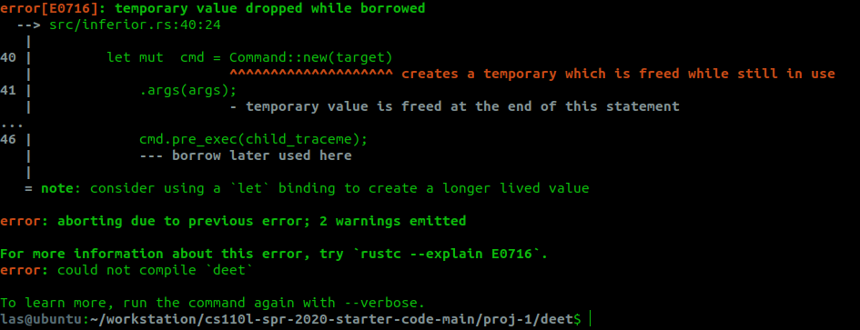

### 概述

1. 子程序以“fork + PTRACE_TRACEME + exec”的形式运行；子程序在执行exec前会收到SIGTRAP信号而暂停。
2. 父进程(inferior)调用wait受到子进程暂停的信号后，调用`ptrace::cont`使子进程继续运行。不断地重复`wait`和`ptrace::cont`来使得程序运行暂停。
3. 当一个程序被ptrace跟踪后，执行`ctrl + C`发送`SIGINT`信号不会终止而是暂停程序。
4. 当程序暂停后，可使用`ptrace::getregs`加上栈结构和Dwarf来获取函数调用栈。
5. 下断点的原理时，暂时的将程序中的指令改为`0xcc`，该指令会调用中断指令来给当前进程发送SIGTRAP信号。
6. 继续从断点执行的原理是，将当前ip-1，然后修改0xcc为原本的字节，调用`ptrace::step`执行到下一句，然后再恢复断点（这样能保证每次循环程序都可以在断点暂停）。


### problems


#### 关于“create a temporary which is freed while still in use”报错

当在使用`Command::new`相关命令时，如果按下述代码编写：

```rust
let mut  cmd = Command::new(target)
            .args(args);

unsafe {
    cmd.pre_exec(child_traceme);
}
```

则会报错：



其原因是，`Command::new`创建了一个名为Command的struct，再调用`.args`方法时，返回了刚创建的Command的引用，但由于刚才这个struct被创建后即被销毁，此后这个引用都是非法的，故调用`cmd.pre_exec`会有报错。


参考链接：https://stackoverflow.com/questions/54056268/temporary-value-is-freed-at-the-end-of-this-statement


#### 关于设计模式、代码结构

- 在`debugger.rs`中的`Debugger::run()`方法里，有一个`loop`下的`match`，这里针对每一条指令分别进行处理。这里处理的代码是应该抽象到一个函数中，还是直接写在这里呢？有的指令比较长，两三行就可以；但有的指令逻辑复杂。
- `debuger.rs`和`inferior.rs`的代码感觉杂糅在一块儿，最好完成全部milestone后更新一下。
- `inferior.continue`方法写的很日怪


#### 关于测试

- 应该要有自动化测试，又图偷懒没有写，在完成`proj-2`时一定要加上。