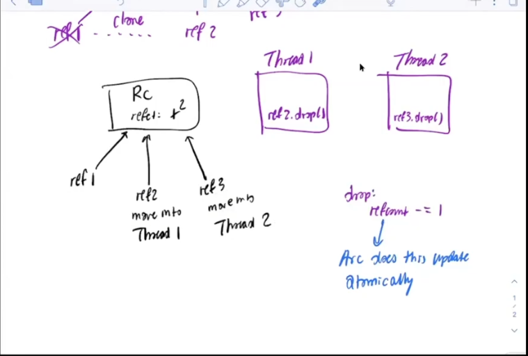

- 谷歌浏览器中使用多线程的地方都是为了提升效率，当使用进程时必然是为了安全

- 一个使用进程的例子：

  chrome针对每个网页都有一个Rendered Process用于运行javascript；同时又有一个统一的Browser Process用于发送网络流量。Browser Process内置了同源策略，且只提供了有限的接口。当攻击者在Rendered Process发现了漏洞后，它的攻击面只能利用Rendered Process的所有权限，而并不能随意的发送网络流量（仍然受到未被攻击的Browser Process的防护）。


message passing model 22:46


#### 关于move关键字

下述代码不能编译成功，因为在这里调用`NAMES[i]`时，相当于borrow了i。但是由于这个i位于主线程的栈上，如果这些其它线程比主线程活的久，那么这个reference可能指向没有意义的空间。

```rust
for i in 0..6 {
	threads.push(thread::spawn(|| {
	println!("Hello from printer {}", NAMES[i]);
	}));
}
```

故而要使用move关键字，它会将闭包中的引用全部move到这个闭包函数中，在这个例子中，由于i是u32，当要move一个u32时，会自动调用其copy trait：

```rust
for i in 0..6 {
	threads.push(thread::spawn(move || {
	println!("Hello from printer {}", NAMES[I]);
	}));
}
```


#### Rc and Arc

Arc和RC作用貌似一样，只是Arc是线程安全的，它使用了lock、atomic一类的东西来确保。

如下图：



当Thread1上调用`drop`时，此时Thread2又调用了`drop`，此时会导致Rc的计数器不会变为原本的值。（有点忘了…应该要看汇编指令这种吧）。

不过使用Arc时就能确保drop的操作是原子的。


同时强调，Rc和Arc调用`clone`只是增加cnt，不会拷贝。


#### mutex

Mutex类似于Option，可以看作是一个容器：`let a :Mutex<usize>`。

同时Mutex相当于线程安全的`RefCell`.

我们可以调用`a.lock()`来获取保护的对象。当到达当前作用域结尾时会自动unlock。

如果想提前unlock，那么就添加括号。


#### notice：

还有几个trait没有讲，在ppt上瞅下。