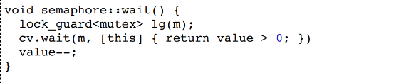
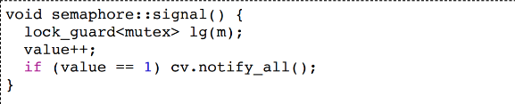

### Synchronization

- Link Explorer中，batch size设置太大后会报错原因：建立网络连接会需要file descriptor，太多线程则会导致不够用。此时可能引入一个线程共享的变量，其最大值为最大可以建立的网络连接，通过线程之间的同步来确保不会出现竞态条件。


#### semaphore

> 信号量

调用`wait`和`signal`前必须要aquire lock以避免竞态条件。


#### rust Mutex比cpp实现要更好的原因

在cpp中，mutex和线程共享的变量是分开存储的，程序员在使用变量时要确保调用了mutex.lock，这只是约定，实现中很可能没有做到导致race condition：

> 如下，程序员很有可能在没有调用`lock_guard<mutex>`的情况下执行`cv.wait`






在rust中，线程共享的变量使用mutex包裹，只要使用变量就会调用mutex.lock，这是必须实现的方式，相对来说更加确保了不会出现竞态条件：

```rust
pub fn send(&self, message: T) {
        let mut  queue = self.queue_and_cv.0.lock().unwrap();
        queue.push_back(message);
        if queue.len() == 1 {
            self.queue_and_cv.1.notify_all();
        }
    }

    // Dequeues -- Like semaphore.wait()
    pub fn recv(&self) -> T {
        let mut  queue = self.queue_and_cv.1.wait_while(self.queue_and_cv.0.lock().unwrap(),
                                                        |queue|{
           queue.is_empty()
        }).unwrap();
        queue.pop_front().unwrap()
    }
```


####  Mutex::lock

调用`Mutex::lock`后获取到的是`MutexGuard<T>`。由于`MutexGuard`自动impl了`Deref`和`DerefMut`两个trait，使得在`MutexGuard`上调用函数能够执行T上的函数。


#### lock poision

在调用`Mutex::lock`时可能会panic：当一个线程在调用lock后panic而终止后，其它线程调用`Mutex::lock`会panic。故而`Mutex::lock`返回值为`LockResult<MutexGuard<'_, T>>`而不是`MutexGuard<...>`。


### channel


#### why?

为何需要channel？比较多线程和多进程的优缺点可知，多线程：

- 👍线程间同步更简单
- 👍上下文切换更快
- :thumbsdown:更容易搞砸：数据竞争

提出channel的目的就是解决多线程容易产生的数据竞争，具体来说：不通过shared memory来通信则不会产生竞态问题。


#### 线程和进程中的 channel对比

在进程中的channel一般是指ipc，其两端一般来说是有一层抽象进行序列化和反序列化；

而在线程中，channel中放入一个对象，另一个线程则可直接取出，没有序列化和反序列化的过程。


#### how

doing by copy or move.

Theory != practice

shallow copy

理论上的线程间channel，不应有共享的内存；

但是如果完全不共享，则会导致线程在传递数据时可能进行大量的复制；

因此，实际上的channel都是进行`shallow copy`，即**发送者**将要发送的数据放在堆上，然后通过栈传递该数据的指针给**接收者**。

注意：这里理论上来说仍然存在竞态问题，因为两边都共享了堆上的数据。在golang中，channel仍然不是安全的。但由于rust中的ownership模型，导致数据进入channel后，发送者不再具有ownership，这样就确保了只有接收者可操纵数据，进而确保了安全。


#### which

- channel更适合生产者和消费者模型
- 对于有全局变量的模型，比如ticket seller，使用mutex要更好些。


#### !question!

- send和recv前都要获取锁，不会死锁吗？

  以`SemaPlusPlus`为例，在`recv`函数处调用了`wait_while`，在调用前我们对`mutex`上锁，而在`wait_while`内部如果判断为true，则会自动解锁，然后等待signal。防止了死锁。


### 语法

下述当返回err时不会panic而只是break。

```rust
while let Ok(next_num) = receiver.recv() {
	...
}
```

