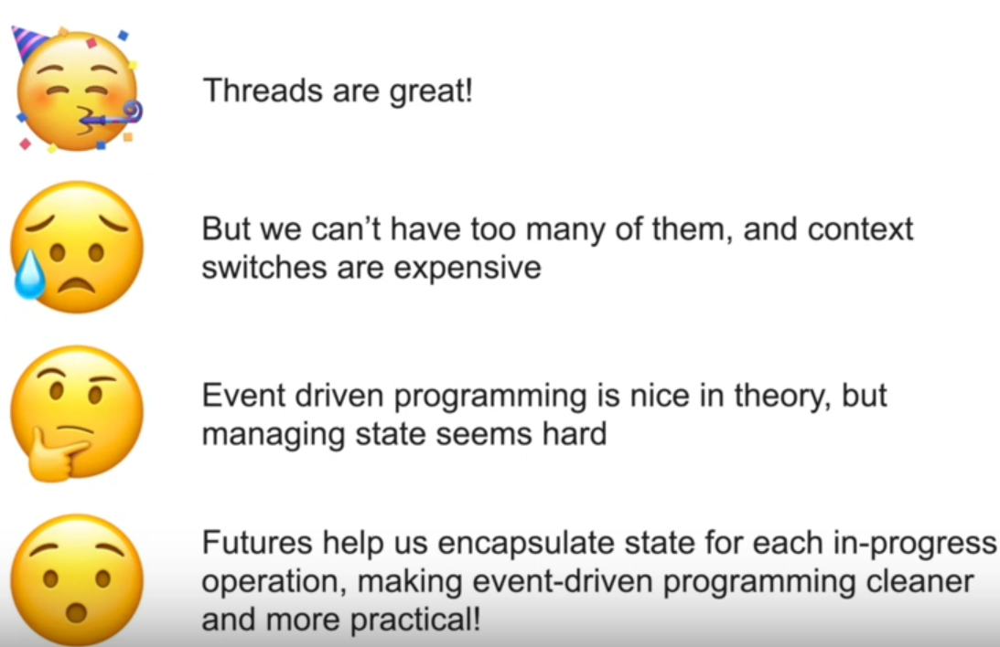
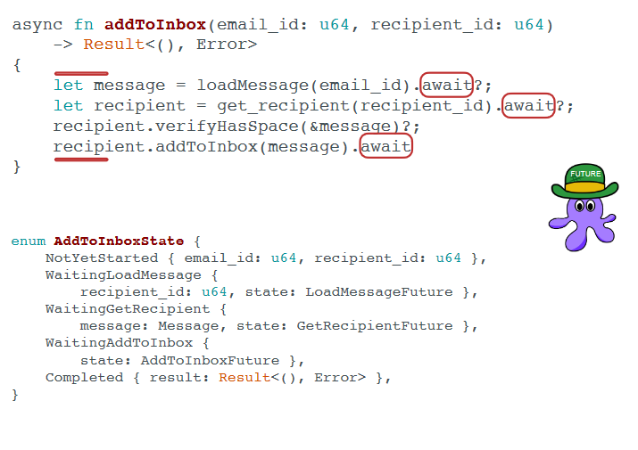
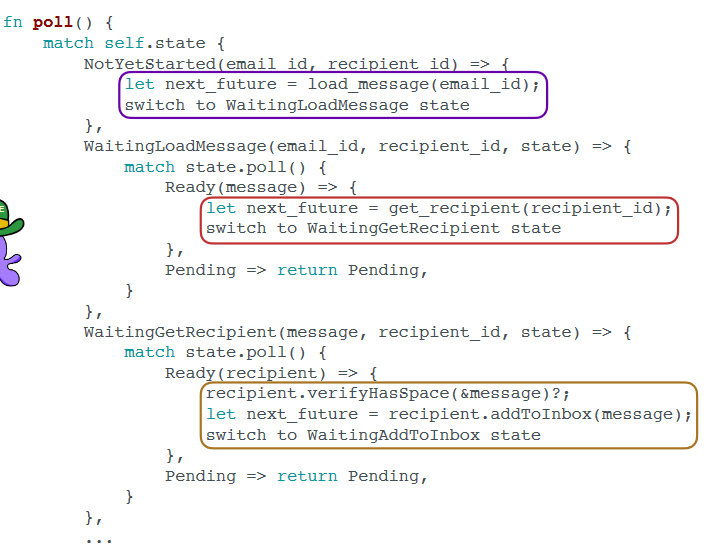

### future1

本节的核心思想是：**如果一个线程正因为某个I/O调用而阻塞，出于节约的目的，也许我们可以让它先去做些别的事情。**我们把它叫做“ event driven programming ”。


当线程在做的某些事情阻塞后，该线程切换去做其它事情，这自然是好的，但是有个问题——如何存储这些事情的状态呢？答案是，Future本身能够存储这些事情的状态和进展，线程本身只需要去调度它们就行。





#### 注意

- `await`只能在`async`代码块或函数中使用。

- 如果有多核，那么tokio可以在多个线程上并行管理`future`。

- 如果在future的poll中调用了sleep、read等可能阻塞的系统调用，则会导致executor线程被阻塞从而无法调度其它future！

  引申的结论：要在**Asynchronous code**中使用非阻塞版本的东西，包括系统调用、mutex等。


### future2

- 一个函数使用`async`后，标明该函数会返回一个`Future`，但是函数内容不会执行！必须调用`Executor`后才能得到实际执行。这也是当`main`函数被标注`async`后需要使用`#[tokio::main]`注解的原因（告诉tokio使用executor执行main函数返回的Future）。

- 普通函数存储在栈上，但`async`函数并不。Future需要某种机制存储函数原本的各种状态，见下：

- 在一个`async`函数内部，其可能在所有`async`代码块或`Future`（本质是一个东西）调用`.await`处被停止。编译器会生成一个`enum`存储所有可能停止的状态，如下：

  

  我们知道，每当Future上的poll函数被调用，就意味着它刚被创建或者其上的某个await得到解决被发送给Executor。不管怎样， poll函数需要知道接下来去做什么，这使用前述的`enum`就能很好的解决：

  

  


### 探究Future Executor的实现机制

本节是阅读https://rust-lang.github.io/async-book/第二部分的笔记。


1. Future的执行需要Executor，而Future一般通过Spawner发送给Executor。Executor和Spawner之间有一个channel用于接收和发送Future。

2. Executor和Spawner之间的channel实际发送的是更高一级的抽象：Task。Task对象会包含指向Future的指针，同时也包含一个指针指向channel用于发送的队列。这是为了让Future的waiter在恰当的时候再次将Future发送给Spawner：

   ```rust
   struct Task {
       future: Mutex<Option<BoxFuture<'static, ()>>>,
       task_sender: SyncSender<Arc<Task>>
   }
   ```

3. Executor的逻辑大致就是不断地从channel中获取Task，调用Task中Future的poll函数，推动task的执行。


相关video || article：

- [The Talk You've Been Await-ing for](https://www.youtube.com/watch?v=NNwK5ZPAJCk)，除了future外，还包含了generator、reactor等概念的引入。其slide上的代码就是async-book第二部分的实验。
- [async book](https://rust-lang.github.io/async-book/)
- [how rust optimizes async/await I](https://tmandry.gitlab.io/blog/posts/optimizing-await-1/)

